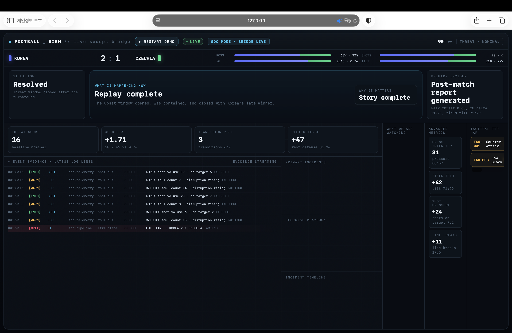

# Football SIEM

**월드컵 빌드데이(2026-06-28)에서 하루 만에 만든 프로토타입이에요.** 축구 경기 데이터를 보안 로그처럼 다뤄서, 경기 흐름을 SIEM(보안 관제) 콘솔처럼 보여줘요. 기록으로 남겨 둔 저장소라 더 이상 고치지 않아요.



> **English summary.** A one-day World Cup build-day prototype (2026-06-28) that dresses live football stats up as a security console: possession, pressure, line breaks and transitions become log lines, severity levels, "incidents", threat hunts and a playbook, and a goal scored against the run of play fires an "upset detected" alert. It is a playful mapping of SOC concepts onto match data, not a security product. Kept as an archived record.

## 무엇을 하나요

4초마다 경기 스냅샷(점유율, 슈팅, xG, 압박, 라인 브레이크, 전환 등)을 가져와서 보안 관제의 개념에 빗대어 보여줘요.

| 축구 | 대시보드에서 보이는 모습 |
|---|---|
| 점유율·스코어가 어긋나는 정도 | 이상 점수(anomaly) → 위협 수준 `NOMINAL` / `ELEVATED` / `CRITICAL` |
| 점유율이 낮은 쪽의 골 | 탐지 규칙 발동: "UPSET DETECTED" 경보, `critical` 인시던트 |
| 압박 강도, 라인 브레이크, 역습 위험, 수비 대형 간격 | 기준을 넘으면 `medium`/`high` 인시던트 |
| 슈팅, 파울, 경기 메모 | 심각도별 로그 줄, 위협 헌팅 항목, 대응 플레이북 |

로그에 붙은 `TAC-001` 같은 전술 코드는 MITRE ATT&CK의 형식을 흉내 낸 이름일 뿐, 실제 ATT&CK 기법이 아니에요.

## 실행

```bash
pip install -r requirements.txt
python app.py   # http://localhost:8000 → "▶ START DEMO"를 누르면 가상 경기가 진행돼요
```

| 환경 변수 | 기본값 | 설명 |
|---|---|---|
| `SOURCE` | `mock` | `mock`(가상 경기: 한국 vs 체코) 또는 `espn`(ESPN 공개 API, 키 필요 없음) |
| `ESPN_LEAGUE` | `fifa.world` | ESPN 리그 코드 |
| `EVENT_ID` | (비어 있음) | 특정 경기 ID |
| `POLL_SECONDS` | `4` | 폴링 간격(초) |

서버는 `0.0.0.0:8000`에 열려요. 같은 네트워크의 다른 기기에서도 접속할 수 있어요.

## 구성

- `app.py`: FastAPI 백엔드. 경기 스냅샷을 가져와 이상 점수·로그·인시던트를 만들어요. `/state`, `/start`
- `index.html`: SIEM 스타일 대시보드 (`/state`를 폴링)
- `assets/Football_SIEM_5slide.pptx`: 5장짜리 발표 자료
- 제출 당시 상태는 [`v1.0`](https://github.com/cynkai/football-siem/releases/tag/v1.0) 태그에 있어요.

## 한계

- 하루 만에 만든 데모예요. 테스트가 없고, 탐지 기준값은 가상 경기에서 보기 좋게 맞춘 값이에요.
- 인시던트 문구 일부에 `KOREA`, `CZECHIA`가 고정돼 있어서 `espn` 모드에서 다른 경기를 보면 팀 이름이 맞지 않아요.
- 실제 보안 로그를 분석하지 않아요. 보안 관제 화면의 개념을 축구 데이터에 빗대어 본 시도예요.

## License

[MIT](LICENSE)
